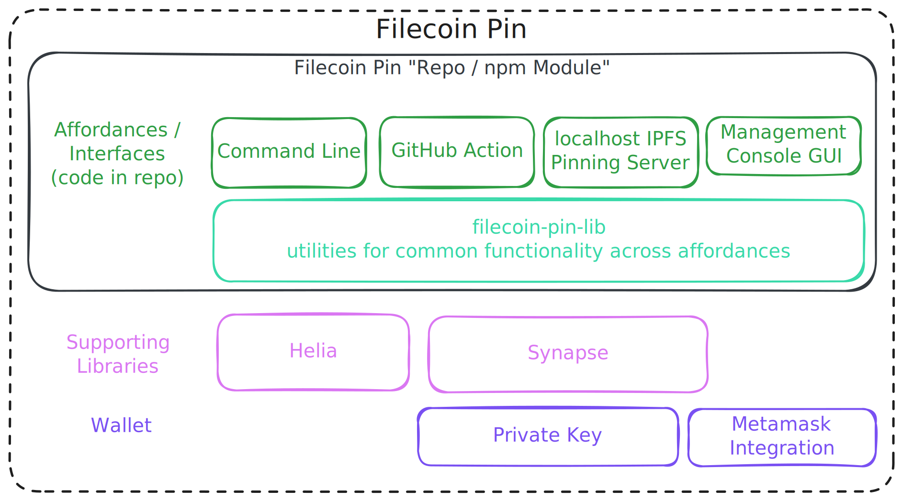

# Filecoin Pin

[](https://nodei.co/npm/filecoin-pin/)

**Store IPFS content on Filecoin's decentralized storage network with verifiable persistence.**

## Status

**Ready for persistent, verifiable data on Filecoin Mainnet.**

Register for updates and a later 2026 Q2 GA announcement at [filecoin.cloud](https://filecoin.cloud/).

## What is Filecoin Pin?

Filecoin Pin is a fully decentralized persistence layer for IPFS content using the global network of Filecoin storage providers with cryptographic guarantees.

When you use Filecoin Pin, your IPFS data gains:

- **Verifiable persistence** - Storage providers must cryptographically prove daily that they continue to store and serve your data
- **Economic incentives** - You only pay when storage proofs are successfully delivered and verified onchain
- **Decentralized infrastructure** - Your data can be stored across a global network of independent storage providers
- **Seamless IPFS integration** - Continue using standard [IPFS Mainnet](https://docs.ipfs.tech/concepts/glossary/#mainnet) tooling (e.g., Kubo, Helia, HTTP Gateways) while gaining Filecoin's persistence guarantees
- **Sovereign data** - Choose your providers, audit storage proofs and payments onchain, with no dependency on a single company

## Who is Filecoin Pin for?

Filecoin Pin is designed for **developers building on IPFS** who need trustless, economically-incentivized persistence for their content. Whether you're building dApps, CI/CD workflows, static websites, AI agents, or other applications, Filecoin Pin provides the missing persistence layer for IPFS.

## Affordances

Filecoin Pin offers multiple affordances to integrate Filecoin storage into your workflow:

### 💻 CLI
Upload IPFS files directly to Filecoin via the command line. Perfect for developers who want to integrate Filecoin storage into scripts, workflows, or local development environments.

- **Status**: Production-ready. It has been recommended to users for months, and is used extensively by the development team.
- **Repository**: This repo ([filecoin-project/filecoin-pin](https://github.com/filecoin-project/filecoin-pin))
- **Documentation**:
  - Run `filecoin-pin --help` to see all available commands and options.
  - [CLI Walkthrough](https://docs.filecoin.io/builder-cookbook/filecoin-pin/getting-started)
- **Installation**: `npm install -g filecoin-pin`
- **Update notice**: Every command quickly checks npm for a newer version and prints a reminder when one is available. Disable with `--no-update-check`.

### ⚙️ GitHub Action
Automatically publish websites or build artifacts to IPFS and Filecoin as part of your CI/CD pipeline. Ideal for static websites, documentation sites, and automated deployment workflows.

- **Status**: Production-ready. Used in the [filecoin-pin-website CI pipeline](https://github.com/filecoin-project/filecoin-pin-website/tree/main/.github/workflows).
- **Repository**: This repo ([see upload-action/](./upload-action/README.md))
- **Documentation**:
   - [GitHub Action Walkthrough](https://docs.filecoin.io/builder-cookbook/filecoin-pin/github-action)
- **Example in Production**: [filecoin-pin-website CI pipeline](https://github.com/filecoin-project/filecoin-pin-website/tree/main/.github/workflows)

### 📚 JavaScript Library
Use Filecoin Pin programmatically in your Node.js or browser applications. The library provides both a high-level API for common use cases and granular core modules for advanced customization.

- **Status**: Production-ready. Powers the CLI, GitHub Action, [filecoin-pin-website](https://github.com/filecoin-project/filecoin-pin-website), and [FOC dealbot](https://github.com/FilOzone/dealbot).
- **Repository**: This repo ([filecoin-project/filecoin-pin](https://github.com/filecoin-project/filecoin-pin))
- **Documentation**:
  - [API Reference](https://filecoin-project.github.io/filecoin-pin/) (TypeDoc-generated documentation)
  - High-level API: `import { … } from 'filecoin-pin'` (recommended for most use cases)
  - Core modules: `import { … } from 'filecoin-pin/core/*'` (CAR files, payments, Synapse SDK, uploads, UnixFS)
- **Installation**: `npm install --save filecoin-pin`

### 📡 IPFS Pinning Server (Daemon Mode)
Run a localhost IPFS Pinning Service API server that implements the [IPFS Pinning Service API specification](https://ipfs.github.io/pinning-services-api-spec/). This allows you to use standard IPFS tooling (like `ipfs pin remote`) while storing data on Filecoin.

- **Status**: Works and is tested, but hasn't received as many features as the CLI. If it would benefit your use case, please comment on the [tracking issue](https://github.com/filecoin-project/filecoin-pin/issues/46) so we can be better informed when it comes to prioritizing.
- **Repository**: This repo (`filecoin-pin server` command in CLI)
- **Usage**: `PRIVATE_KEY=0x... npx filecoin-pin server` (or use session key auth — see [Configuration](#configuration))

### 📊 Management Console GUI
Web-based management console for monitoring and managing your Filecoin Pin deployments. This is effectively a Web UI equivalent to the [CLI](#-cli) affordance.

- **Status**: Planned
- **Tracking**: See [issue #74](https://github.com/filecoin-project/filecoin-pin/issues/74) for updates. Please leave a comment about your use case if this would be particularly beneficial.

## Documentation
See [/documentation](/documentation/README.md).

## Examples

See Filecoin Pin in action:

- **[upload-action](https://github.com/filecoin-project/filecoin-pin/tree/master/upload-action)** - Example GitHub Action workflows demonstrating automated IPFS/Filecoin uploads
- **[filecoin-pin-website](https://github.com/filecoin-project/filecoin-pin-website)** - Demo dApp showing browser-based file uploads to Filecoin
   - [Walkthrough](https://docs.filecoin.io/builder-cookbook/filecoin-pin/dapp-demo)
   - [🎥 Recording 1](https://www.youtube.com/watch?v=UElx1_qF12o)
   - [🎥 Recording 2](https://www.youtube.com/watch?v=DXH84_gI-c0)
- **[dealbot](https://github.com/FilOzone/dealbot)** - Tool used by the FOC development team and Storage Provider community for automated storage deal testing and monitoring, demonstrating production use of the filecoin-pin library.

## Architecture

### The Big Picture

Filecoin Pin bridges IPFS and Filecoin to provide verifiable persistence for content-addressed data:


### Filecoin Pin Structure

This repository contains multiple affordances for user interaction and a shared library for consistent functionality:

<!-- Source: SVG exported from https://excalidraw.com/#room=1f613b355f33017ef481,u79JBN2E38noC8NpW8DkMQ -->


The [Synapse SDK](https://synapse.filecoin.services/) is the main library, as it's doing the work of interfacing with the rest of [Filecoin Onchain Cloud](https://filecoin.cloud) including smart contracts, Filecoin Storage Providers, and more.

[Helia](https://helia.io/) is leveraged for turning files and directories into IPFS compatible data, which we output in [CAR format](https://ipld.io/specs/transport/car/carv1/).

The affordances were [discussed more above](#affordances).  All affordances use the same core library, ensuring consistent behavior and making it easy to add new interfaces in the future.

## Telemetry

Filecoin Pin collects telemetry.  A few things:
* Telemetry always [has a way to be disabled](#how-to-disable-telemetry).
* We don't collect Personal identifiable information (PII).
* Telemetry is enabled by default for the [affordances](#affordances), requiring a consumer/user to opt out.  We are defaulting as "enabled" to help make sure we have a good pulse on the user experience and can address issues correctly. Maintainers are particularly focused on validating functionality and ironing out problems throughout the whole Filecoin Onchain Cloud stack that `filecoin-pin` relies on.

What we collect:
* **Per-upload copy outcomes** posted directly to [BetterStack's HTTP metrics ingestion endpoint](https://betterstack.com/docs/logs/ingesting-data/http/metrics/), so we can measure the success rate of multi-copy uploads and identify which storage providers (or pipeline steps) are failing. See [`documentation/events-and-metrics.md`](documentation/events-and-metrics.md) for the full schema, including the underlying events and the relationship between this metric and the Synapse SDK's upload result.


  **Delivery model.** Each `executeUpload` fires its own HTTP POST containing one [`uploadCopyStatus`](documentation/events-and-metrics.md#uploadcopystatus) counter and one paired [`uploadCopyBytes`](documentation/events-and-metrics.md#uploadcopybytes) gauge per resolved copy outcome — there is no in-memory buffer or periodic flush. The CLI, pinning server, and GitHub Action `await flushTelemetry()` before exit so any in-flight request finishes. **Long-running consumers that terminate via `process.exit()`, `SIGINT`, or `SIGTERM` should do the same** (`flushTelemetry` is exported from `filecoin-pin/core/telemetry`). To silence subsequent `recordUploadResult` calls without exiting the process, call `configureTelemetry({ disabled: true })`.

  **Library usage (Node and browser).** The telemetry library never reads `process.env`. Configure it programmatically before the first `executeUpload` — the same API works in both runtimes:

  ```ts
  import { configureTelemetry } from 'filecoin-pin/core/telemetry'

  configureTelemetry({ disabled: true })                       // opt out
  configureTelemetry({ affordance: 'pin.filecoin.cloud' })   // tag the surface (default 'Library')
  ```

  The CLI's env-var support is built on top of this API (see `src/read-telemetry-config-from-env.ts`); other Node hosts can follow the same pattern.

### How to disable telemetry

- **CLI / pinning server / GitHub Action:** set `FILECOIN_PIN_TELEMETRY_DISABLED=true` (or the cross-tool standard `DO_NOT_TRACK=1`) in the host environment / workflow `env:` block. The Action also accepts `disableTelemetry: true` as an input; either signal silences telemetry.
- **Library consumers:** pass `{ disabled: true }` to `configureTelemetry()`.

## Quick Start

### Prerequisites

- **Node.js 24+** for CLI and library usage
- **Filecoin wallet** (Calibration testnet or Mainnet) with:
  - **For Calibration testnet:**
    - Test FIL for transaction gas ([Faucet](https://faucet.calibnet.chainsafe-fil.io/funds.html))
    - Test USDFC stablecoin for storage payments ([USDFC Faucet](https://forest-explorer.chainsafe.dev/faucet/calibnet_usdfc))
  - **For Mainnet:**
    - FIL for transaction gas
    - USDFC stablecoin for storage payments

### Installation

```bash
npm install -g filecoin-pin
```

### Basic Usage

```bash
# 0. Set up authentication (choose one):
#    Private key:   export PRIVATE_KEY=0x...
#                   (or pass --private-key <key> to each command)
#    Session key:   export WALLET_ADDRESS=0x... SESSION_KEY=0x...
#                   (or pass --wallet-address <addr> --session-key <key> to each command)

# 1. Configure payment permissions (one-time setup)
filecoin-pin payments setup --auto

# 2. Upload a file to Filecoin (defaults to Mainnet)
filecoin-pin add myfile.txt

# 3. Verify storage with cryptographic proofs
filecoin-pin data-set <dataset-id>

# To use Calibration testnet (not persistent) instead:
filecoin-pin add myfile.txt --network calibration
```

For detailed guides, see:
- **CLI**: [Complete CLI walkthrough](https://docs.filecoin.io/builder-cookbook/filecoin-pin/filecoin-pin-cli)
- **GitHub Action**: [CI/CD integration guide](https://docs.filecoin.io/builder-cookbook/filecoin-pin/github-action)
## Configuration

Configuration of the Filecoin Pin CLI can be performed either with arguments, or environment variables.

The Pinning Server requires the use of environment variables, as detailed below.

### Network Selection

Filecoin Pin supports **Mainnet**, **Calibration testnet**, and local **devnet** networks. By default, the CLI uses Mainnet.

**Using the CLI:**
```bash
# Use Mainnet (default)
filecoin-pin add myfile.txt

# Explicitly specify Mainnet
filecoin-pin add myfile.txt --network mainnet

# Use Calibration testnet
filecoin-pin add myfile.txt --network calibration

# Use a local foc-devnet (reads config from devnet-info.json, details below)
filecoin-pin add myfile.txt --network devnet
```

**Using environment variables:**
```bash
# Set network via environment variable
export NETWORK=mainnet
filecoin-pin add myfile.txt

# Or override RPC URL directly
export RPC_URL=wss://wss.node.glif.io/apigw/lotus/rpc/v1
filecoin-pin add myfile.txt
```

**Selection rules:**

* `--network` and `--rpc-url` (and their `NETWORK` / `RPC_URL` env equivalents) are mutually exclusive. Passing both is an error.
* When `--rpc-url` (or `RPC_URL`) is set, Filecoin Pin probes the endpoint's `eth_chainId` at startup and uses the matching chain (mainnet, calibration, or a configured devnet).
* When neither is set, Filecoin Pin defaults to Mainnet.

### Common CLI Arguments

* `-h`, `--help`: Display help information for each command
* `-V`, `--version`: Output the version number
* `-v`, `--verbose`: Verbose output
* `--private-key`: Ethereum-style (`0x`) private key (wallet and signer), funded with USDFC
* `--wallet-address`: Session key mode: owner wallet address
* `--session-key`: Session key mode: scoped signing key registered to the wallet
* `--network`: Filecoin network to use: `mainnet`, `calibration`, or `devnet` (default: `mainnet`). Mutually exclusive with `--rpc-url`.
* `--rpc-url`: Filecoin RPC endpoint. Filecoin Pin probes its `eth_chainId` to derive the chain. Mutually exclusive with `--network`.

Other arguments are possible for individual commands, use `--help` to find out more.

### Environment Variables

```bash
# Required
PRIVATE_KEY=0x...              # Ethereum private key with USDFC tokens

# Optional - Network Configuration
NETWORK=mainnet                # Network to use: mainnet, calibration, or devnet (default: mainnet)
RPC_URL=wss://...              # Filecoin RPC endpoint (overrides NETWORK if specified)
                               # Mainnet: wss://wss.node.glif.io/apigw/lotus/rpc/v1
                               # Calibration: wss://wss.calibration.node.glif.io/apigw/lotus/rpc/v1

# Optional for Pinning Server Daemon
PORT=3456                      # Daemon server port
HOST=localhost                 # Daemon server host
DATABASE_PATH=./pins.db        # SQLite database location
CAR_STORAGE_PATH=./cars        # CAR file storage directory
LOG_LEVEL=info                 # Logging verbosity (info, debug, error)

# Optional - Telemetry (see "Telemetry" above)
FILECOIN_PIN_TELEMETRY_DISABLED=true        # Disable all telemetry
DO_NOT_TRACK=1                              # Standard cross-tool opt-out
```

### Default Data Directories

When `DATABASE_PATH` and `CAR_STORAGE_PATH` are not specified, data is stored in platform-specific locations:
- **Linux**: `~/.local/share/filecoin-pin/`
- **macOS**: `~/Library/Application Support/filecoin-pin/`
- **Windows**: `%APPDATA%/filecoin-pin/`

### Local Development with foc-devnet

When using `--network devnet`, Filecoin Pin reads connection details from a running [foc-devnet](https://github.com/filecoin-project/foc-devnet) instance:

- **Private key**: Automatically resolved from `devnet-info.json` (no `PRIVATE_KEY` needed)
- **RPC URL**: Read from the devnet chain configuration
- **Contract addresses**: Resolved from the devnet chain definition
- **IPNI verification**: Automatically skipped (no IPNI infrastructure on devnet)

**Environment variables for devnet:**

| Variable | Description | Default |
|----------|-------------|---------|
| `FOC_DEVNET_BASEDIR` | Override the foc-devnet base directory | `~/.foc-devnet` |
| `DEVNET_INFO_PATH` | Explicit path to `devnet-info.json` (overrides basedir) | `<basedir>/state/latest/devnet-info.json` |
| `DEVNET_USER_INDEX` | Which user from `devnet-info.json` to use | `0` |

## Development

Want to contribute to Filecoin Pin or run it locally? See
[DEVELOPMENT.md](./DEVELOPMENT.md) for setup, scripts, debugging tips, HTTP
tracing, running against a local devnet, and working with an unpublished
`synapse-sdk` checkout.

Repository development uses `pnpm` workspaces. The published package can still
be installed with `npm`, `pnpm`, or other package managers.

## Community and Support

### Contributing

Interested in contributing? Please read our [Contributing Guidelines](CONTRIBUTING.md) for information on commit conventions, PR workflows, etc.

### Get Help

- **Issues**: Found a bug or have a feature request? [Open an issue](https://github.com/filecoin-project/filecoin-pin/issues) in this repository
- **Community Discussion**: Join the conversation in Filecoin Slack's public [#fil-foc](https://filecoinproject.slack.com/archives/C07CGTXHHT4) channel

### Documentation

See [Documentation](#documentation) above for all guides and references.


## License

Dual-licensed under [MIT + Apache 2.0](LICENSE.md)
