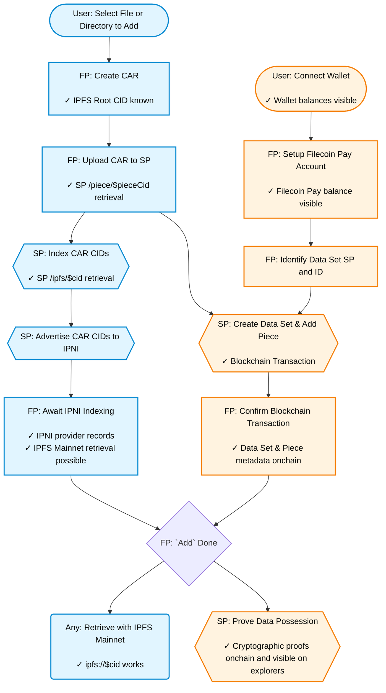

## Purpose

The steps outlined below are taken to "add a file with Filecoin Pin".  This document is intended to provide more info about what happens "behind the scenes" as it uses underlying libraries like [`synapse`](glossary.md#synapse) and the [Filecoin Onchain Cloud](glossary.md#filecoin-onchain-cloud) offering.

## Diagram

_Key_ 
Blue | Orange | FP | SP
-- | -- | -- | --
non-blockchain step | blockchain step | Filecoin Pin | Storage Provider

## Steps without Blockchain Interactions

These are the set of steps that are done client side (i.e., where the Filecoin Pin code is running) and with a [Storage Provider](glossary.md#storage-provider) that don't involve the Filecoin blockchain.  These steps in isolation though don't yield a committed cryptographic proof of the data being possessed by and retrievable from an SP, but they are necessary preconditions.

### Create CAR

*What/why:*

The provided file needs to be turned into a Merkle DAG and have the DAG's blocks transported to an SP.  [CAR](glossary.md#car) is a common container format for transporting blocks in the IPFS ecosystem and is used with Filecoin Pin.  Storage providers store and prove contiguous sequence of bytes, but generating IPFS compatible data from files and directories creates potentially very many small "blocks" of data, which we pack into a single CAR container for [Storage Providers](glossary.md#storage-provider) (SPs) to store and prove. The process of packing in IPFS form, or "DAGifying" the file data, allows us to reference and verify smaller units of our content, and gives us the ability to interact _trustlessly_ with SPs to serve and retrieve our file data.

Implementation notes:
- The CAR file is created using Helia for UnixFS DAG creation.
- Individual files are wrapped in a directory so that the filename is preserved via UnixFS metadata.

*Outputs:*

v1 CAR containing the Merkle DAG representing the provided file.  There is one root in the CAR, and it represents the root of the DAG for the input file.  This is referred to as the "[IPFS Root CID](glossary.md#ipfs-root-cid)".

*Expected duration:*

This is a function of the size of the input file and the hardware. Typical DAGification of files and directories is relatively quick as it's simply a matter of chunking and hashing using common algorithms. The most time-consuming part is the generation of the ["Piece CID](glossary.md#piece-cid) of the whole CAR on the client side prior to upload, where a a 1Gb input can take upwards of a minute.  As the car is being created, it can be streamed to an SP, which is most likely the bottleneck.

### Upload CAR

*What/why:*

The [Storage Provider](glossary.md#storage-provider) (SP) needs to be given the bytes to store so it can serve retrievals and prove to the chain that it possesses them.   This is done via an HTTP `PUT /pdp/piece/upload`.

The upload includes [metadata](glossary.md#metadata) that will be stored on-chain:
- `ipfsRootCid`: The IPFS Root CID, linking the [Piece](glossary.md#piece) back to IPFS
- `withIPFSIndexing`: Signals the SP to index and advertise to [IPNI](glossary.md#ipni)

*Outputs:*

SP parks the Piece and queues it up for processing, while the client gets an HTTP response with the [Piece CID](glossary.md#piece-cid).  The server calculates the Piece CID for the data and confirms that it matches the Piece CID calculated and provided by the Filecoin Pin client to provide assurance that we are providing the exact bytes we expect.

Since the SP has the data for the Piece, it can be retrieved with https://sp.domain/piece/$pieceCid retrieval.

*Expected duration:*

This is a function of the CAR size and the throughput between the client and the SP.  

### Index and Advertise CAR CIDs

*What/why:*

At some point after receiving the uploaded [CAR](glossary.md#car), an SP indexing task processes the CAR and creates a local mapping of CIDs to offsets within the CAR so it can serve IPFS style retrievals.  Following that, an SP [IPNI](glossary.md#ipni) tasks picks up the local index, makes and IPNI advertisement chain, and then announces the advertisement chain to IPNI indexers like filecoinpin.contact and cid.contact so they know to come and get the advertisement chain to build up their own index.

Filecoin Pin validates the IPNI advertisement process by polling `https://filecoinpin.contact/cid/$cid` (NOT cid.contact due to [negative caching issues discussed below](#how-long-does-an-ipni-indexer-cache-results)). 

*Outputs:*

Once the SP has indexed the CAR, it can be directly retrieved from the SP (i.e., bypassing IPFS Mainnet content routing) using https://sp.domain/ipfs/$cid retrieval.

The SP produces a new or updated advertisement chain.  By the end, IPNI indexers should have additional provider records for the advertised CIDs.

*Expected duration:*

Local indexing of the CAR is quick as the CAR already contains a list of CIDs and their offsets, which is verified and reused.  Creating/updating an advertisement chain and announcing it to IPNI indexers is also quick.  There is a delay in an IPNI indexer on the order of seconds for coming to grab the advertisements plus some ingestion delay on the IPNI indexer side.

## Blockchain related steps

Below are the set of steps that are particularly unique from traditional IPFS usage as they involve authorization, payment, and cryptographic proofs.

### Connect Wallet

*What/why:*

Filecoin Pin needs to interface with the Filecoin blockchain to authorize and send payment to [storage providers](glossary.md#storage-provider) (SPs) for their work of storing and proving possession of data.  This requires having a secret key to sign messages sent to the blockchain.

Currently `filecoin-pin` expects to be explicitly passed a private key via environment variable or command line argument.  [filecoin-pin-website](glossary.md#filecoin-pin-website) as [pin.filecoin.cloud](http://pin.filecoin.cloud) uses a global [session key](glossary.md#session-key) which can be embedded into source code since it scopes down the set of actions that can be performed and alleviating the need for a user to provide a wallet to perform operations.

*Outputs:*

Once a wallet is connected, [USDFC](glossary.md#usdfc) and [FIL](glossary.md#fil) balances  in the wallet itself can be inspected.

*Expected duration:* 

Less than 1 second once a wallet private key is provided.

### Setup Filecoin Pay account

*What/why:*

To prepare to make a "deal" with an SP to store data, these actions need to occur:

1. Permit the user's [Filecoin Pay](glossary.md#filecoin-pay) account to use [USDFC](glossary.md#usdfc).  This is a one-time authorization.
2. Approve FilecoinWarmStorage as an operator of Filecoin Pay funds.  This is a one-time authorization.
3. Deposit at least enough funds into Filecoin Pay to cover the lock-up period for the created [CAR](glossary.md#car).

If they haven't occurred before, then they will be handled as part of the first deposit into the Filecoin Pay account from filecoin pin.  A single `depositWithPermitAndApproveOperator` transaction handles all of these actions.

*Outputs:*

The Filecoin Pay account has a non-zero balance.

*Expected duration:*

As a single transaction, this takes ~30 seconds to be confirmed onchain.  

### Identify a Data Set SP and ID

*What/why:*

In order to upload a [CAR](glossary.md#car), Filecoin Pin needs to identify the SP to upload to.  This strategy is followed (assuming no overrides are provided):

1. If the chain has record of a [Data Set](glossary.md#data-set) created by the wallet with the Data Set [metadata key](glossary.md#metadata) `source` set to 'filecoin-pin', then that DataSet ID and corresponding SP are used.  If there are multiple, then the one storing the most data will be used.
2. If there is no existing Data Set, then a new Data Set is created using an approved [Storage Provider](glossary.md#storage-provider) from the [Storage Provider Registry](glossary.md#service-provider-registry).

*Outputs:*

- An existing Data Set ID to use or empty if a new Data Set should be created
- SP id to use for CAR upload and Data Set creation (if needed).

*Expected duration:*

This should take less than a couple of seconds as it involves hitting RPC providers to get chain state.

### Create Data Set if necessary and Add Piece

*What/why:*

A single blockchain transaction that create a [Data Set](glossary.md#data-set) if one doesn't already exist and adds a [Piece](glossary.md#piece) to the Data Set for the corresponding [CAR](glossary.md#car) file.  This is done as one operation rather than just "Create Data Set" and "Add Piece" to improve interaction latency.  The Piece uses a Filecoin-internal hash function resulting in a [Piece CID](glossary.md#piece-cid), which is what is stored onchain.  The [Filecoin Warm Storage Service](glossary.md#filecoin-warm-storage-service) then has record of what SP is storing which data that it needs to periodically prove it has possession of.  Filecoin Pin stores additional [metadata](glossary.md#metadata) on the piece denoting that the uploaded data should be indexed by the SP and advertised to [IPNI](glossary.md#ipni) indexers.  

*Outputs:*

A record onchain denoting the data that needs to periodically be proven to be in the possession of the Data Set’s SP.

*Expected duration:*

As a single transaction, this takes ~30 seconds to be confirmed onchain.