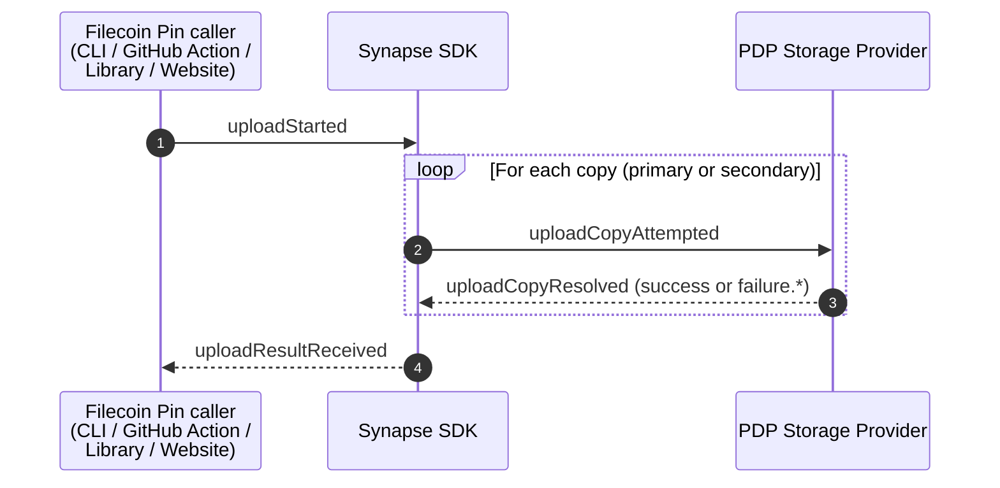

# Filecoin Pin Events & Metrics

This document is the intended **source of truth** for the events emitted by Filecoin Pin and the metrics computed from them. It is intended for Filecoin Pin dashboard consumers and maintainers who need to understand what each metric means and where it comes from.

> **Note on "events":** the entries in the [Event List](#event-list) are named **timing markers** used to define when metrics are emitted — they are not all emitted as discrete events or log lines. Each marker is anchored in code (as a timestamp variable, log line, or status transition) and used to compute the metrics in the [Metrics](#metrics) section.

## Upload Event Model

An upload (`executeUpload` in the [JavaScript library](../README.md#-javascript-library)) asks the [Synapse SDK](glossary.md#synapse) to replicate the same [Piece](glossary.md#piece) across one primary and zero or more secondary copies. Each copy is an independent attempt against a single [Storage Provider](glossary.md#service-provider); the SDK reports one outcome per copy in a single result object. Filecoin Pin records one telemetry event per resolved copy outcome.

### Upload Event Timeline

### Event List

| Event | Definition | Source of truth |
|------|------------|-----------------|
| `uploadStarted` | Filecoin Pin invokes `executeUpload` for one piece. | [`src/core/upload/index.ts`](../src/core/upload/index.ts) |
| `uploadCopyAttempted` | The Synapse SDK begins one copy attempt against a specific SP. Implicit marker — emitted once per entry that later shows up in `result.copies` or `result.failedAttempts`. | [`@filoz/synapse-sdk`](https://github.com/FilOzone/synapse-sdk) |
| `uploadCopyResolved` | A copy attempt produces a terminal outcome (`success` or one of the `failure.*` values). Drives [`uploadCopyStatus`](#uploadCopyStatus). | [`src/core/telemetry/index.ts`](../src/core/telemetry/index.ts) |
| `uploadResultReceived` | `executeUpload` returns with `{copies, failedAttempts}`. This is the point at which `recordUploadResult` is called and the [`uploadCopyStatus`](#uploadCopyStatus) data points are submitted. | [`src/core/upload/index.ts`](../src/core/upload/index.ts) |

## Metrics

Metrics ship as [direct HTTP POSTs](https://betterstack.com/docs/logs/ingesting-data/http/metrics/) to BetterStack from [`src/core/telemetry/index.ts`](../src/core/telemetry/index.ts). One "upload" typically produces several metric data points (one per "copy" outcome).

### Common Tags

Every metric emitted by Filecoin Pin carries the following tags:

| Tag | Values | Definition |
|---|---|---|
| `affordance` | `CLI`, `GitHub Action`, `Library`, `pin.filecoin.cloud` | Which [affordance](../README.md#affordances) emitted the metric. Set by the host via `configureTelemetry({ affordance })`; defaults to `Library` when not configured. `configureTelemetry` rejects any other value at runtime. |
| `network` | `mainnet`, `calibration`, `devnet` | The Filecoin network the upload targeted. |

### Status Count Related Metrics

- These count metrics track the occurrence of a particular outcome for an event.
- All status count metrics carry an additional `value` tag that attributes the count to a specific outcome.

| Metric | Relevant Events | When Emitted | `value` Values | Source of truth |
|---|---|---|---|---|
| `uploadCopyStatus` | [`uploadCopyResolved`](#uploadCopyResolved) | Once per copy in the upload result — one per entry in `result.copies` and one per entry in `result.failedAttempts`. | `success` (copy committed by the SP), `failure.pull` (Synapse pull step failed), `failure.commit` (Synapse commit step failed), `failure.other` (any other Synapse-reported failure). | [`src/core/telemetry/index.ts`](../src/core/telemetry/index.ts) |

In addition to the [common tags](#common-tags) and `value`, `uploadCopyStatus` carries:

- `spId` — [Storage Provider](glossary.md#service-provider) ID, stringified from the SDK's `providerId`.
- `role` — `primary` or `secondary`, per the Synapse SDK.

To compute the **upload success rate of all copies (independent of "primary" or "secondary")** over a window, divide the number of data points tagged `value=success` by the total number of `uploadCopyStatus` data points. To isolate a failure mode (e.g. commit-step regressions across SPs), filter on `value=failure.commit` and group by the `spId` tag.

Note that this computation doesn't directly answer "what proportion of golden-path 'adds' succeed" since:
1. "adds" that only want a single upload (no extra copies) will be included AND
2. "adds" that specify more than a single extra copy will add more weight to the metric
[#516](https://github.com/filecoin-project/filecoin-pin/issues/516) is tracking more accurately answer this question.

> Querying in BetterStack: `uploadCopyStatus` is ingested as a counter, but each point is a flat `value:1`, so the default counter aggregation (`avgMerge(rate_avg)`) reads ~0. Count points with `sum(metrics_count)` and read tags via `label('value')` / `label('spId')` instead.

### Gauge Metrics

- These metrics carry a single numeric reading per point.
- Each gauge point is emitted alongside the corresponding [`uploadCopyStatus`](#uploadCopyStatus) point, sharing its tag set so the two metrics can be joined at query time.

| Metric | Relevant Events | When Emitted | Gauge Value | Source of truth |
|---|---|---|---|---|
| `uploadCopySize` | [`uploadCopyResolved`](#uploadCopyResolved) | Once per copy in the upload result, paired with [`uploadCopyStatus`](#uploadCopyStatus). | Piece size in bytes (`UploadResult.size`). All copies of one upload share the same size — the value identifies the upload that produced the outcome. | [`src/core/telemetry/index.ts`](../src/core/telemetry/index.ts) |

`uploadCopySize` carries the same per-metric tags as `uploadCopyStatus` (`spId`, `role`, `value`) plus the [common tags](#common-tags), so you can filter `value=failure.commit` and aggregate `uploadCopySize` to see the size distribution of commit-step failures (`avg`, `p99`, `sum` by `spId`, etc.).
